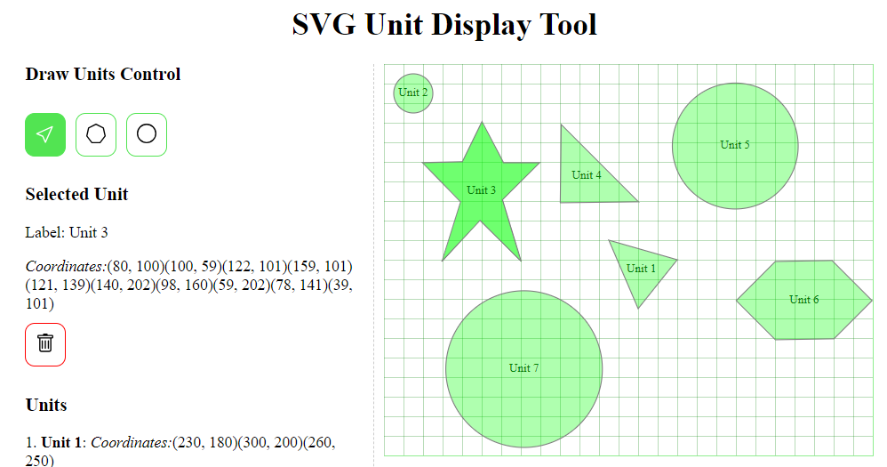

# SVG Unit Display Tool



This is a simple web application designed to display unit information on a floor plan. The application is built using React with TypeScript and Vite as the build tool.

## Features

- **Floor Plan Display**: Shows a floor plan with multiple units represented as colored rectangles.
- **Unit Selection**: Click on a unit to view its details in a sidebar. Clicking on an already selected unit will deselect it.
- **Drawing Mode**: Allows users to draw new units on the floor plan as either polygons or circles.
- **Interactive Unit Creation**: Users can click to create polygon points or drag to create circles on the floor plan.
- **Unit Deletion**: Users can delete a selected unit directly from the sidebar.

## Getting Started

To run the application locally, follow these steps:

1. **Clone the Repository**:
   ```bash
   git clone https://github.com/AdrianBirta/svg-unit-display-tool.git

2. **Navigate to the Project Directory**:
   ```bash
   cd svg-unit-display-tool

3. **Install Dependencies**:
   ```bash
   npm install

4. **Start the Development Server**:
   ```bash
   npm run dev

5. **Open the Application**:

Open your browser and navigate to http://localhost:5173 to see the application in action

## Code Explanation

- **App.tsx**: Manages the state of the units, including creating, selecting, and deleting them. It also handles the interaction between the `FloorPlan.tsx` and `Sidebar.tsx` components.
- **FloorPlan.tsx**: Renders the SVG floor plan, including the existing units and any new shapes being drawn. Handles user interactions like clicking to create points or dragging to create circles.
- **Unit.tsx**: A wrapper component that decides whether to render a `PolygonUnit.tsx` or `CircleUnit.tsx` based on the type of the unit.
- **PolygonUnit.tsx**: Represents individual polygon units within the SVG, allowing for rendering and user interaction.
- **CircleUnit.tsx**: Represents individual circle units within the SVG, allowing for rendering and user interaction.
- **Sidebar.tsx**: Displays details of the currently selected unit, provides controls for toggling between selection and drawing modes, and allows deletion of units.
- **DrawControl.tsx**: Provides UI controls for switching between selection mode and the different drawing modes (polygon or circle).
- **interfaces.ts**: Defines the TypeScript interfaces used across the application for strong typing.
- **typeGuards.ts**: Contains type guard functions to differentiate between polygon and circle units.
